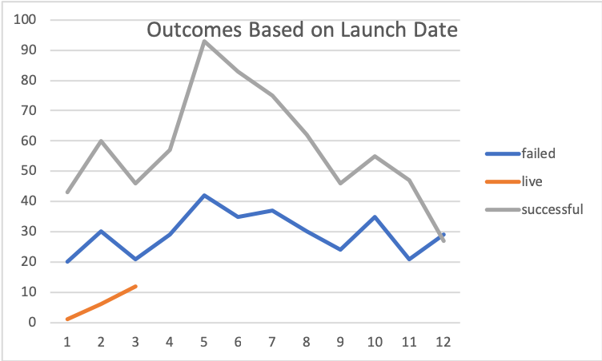

# Kickstarter-Analysis

### Performing analysis on Kickstarter data to uncover trends. 

The greater the goal amount, the more likely a campaign is to fail. 

Campaigns that begin in May and June tend to have the highest success rate. 
